# Architecture Diagram: 2018 Rust S3 Lifecycle CLI Tool

## Overview
This document provides architectural diagrams for the AWS S3 Lifecycle and Archival Management CLI tool built with 2018-era Rust patterns.

---

## High-Level Architecture

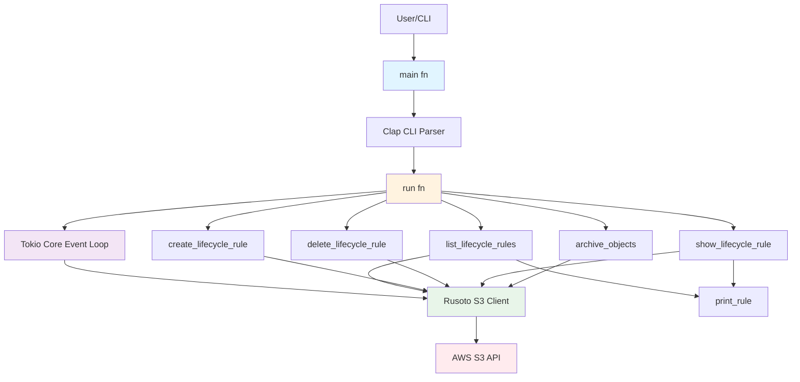

---

## Command Flow Architecture

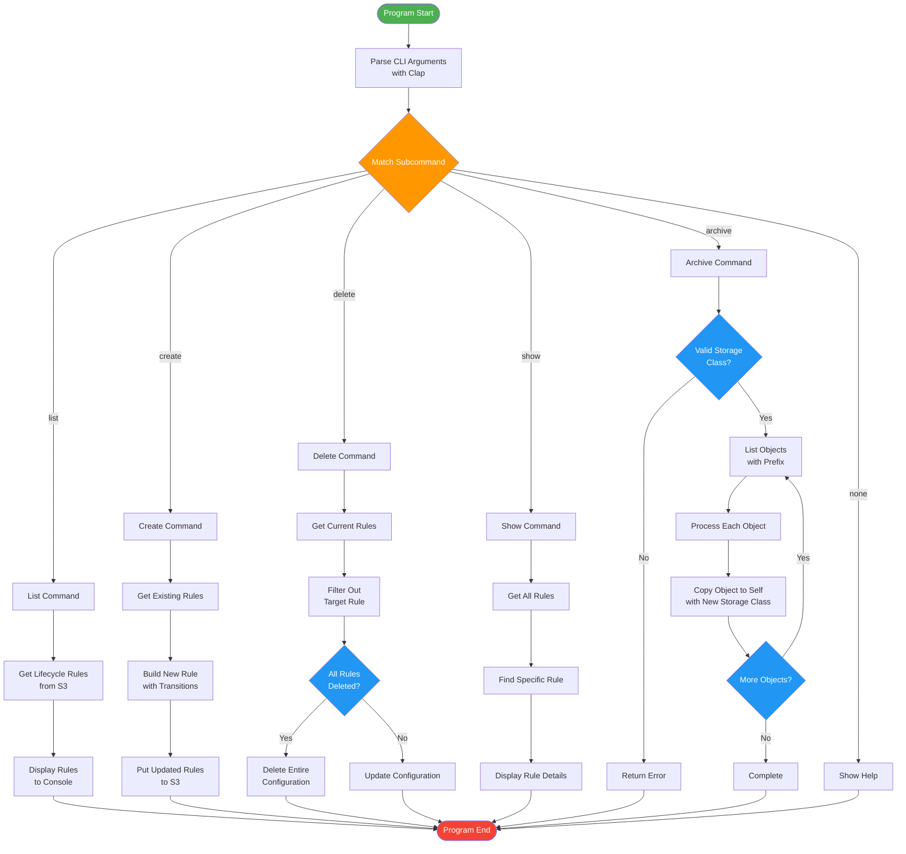

---

## Data Flow: Create Lifecycle Rule

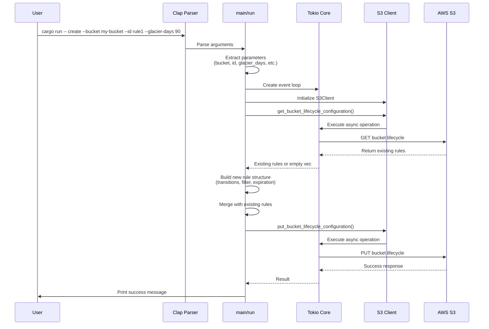

---

## Data Flow: Archive Objects

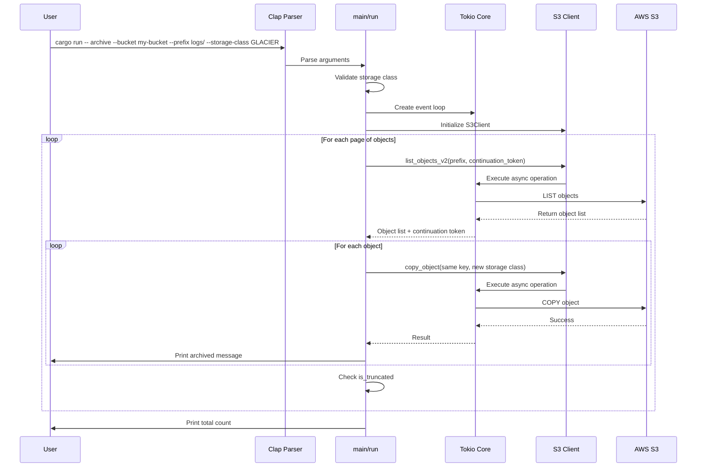

---

## Technology Stack

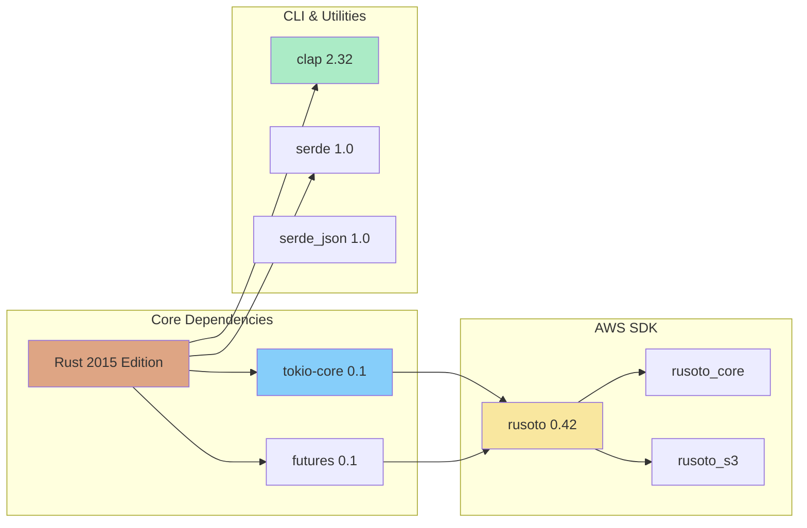

---

## Component Interaction Diagram

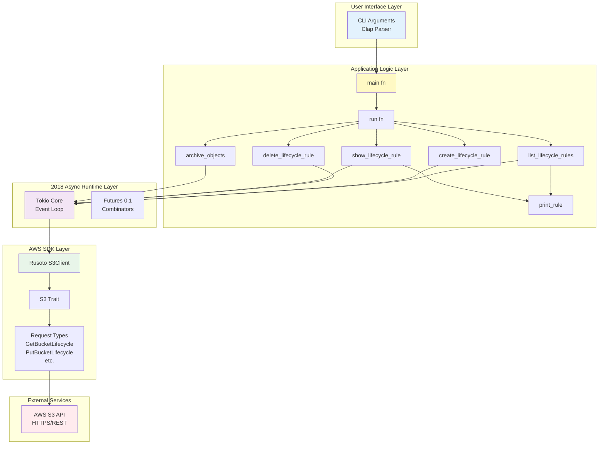

---

## Lifecycle Rule Structure

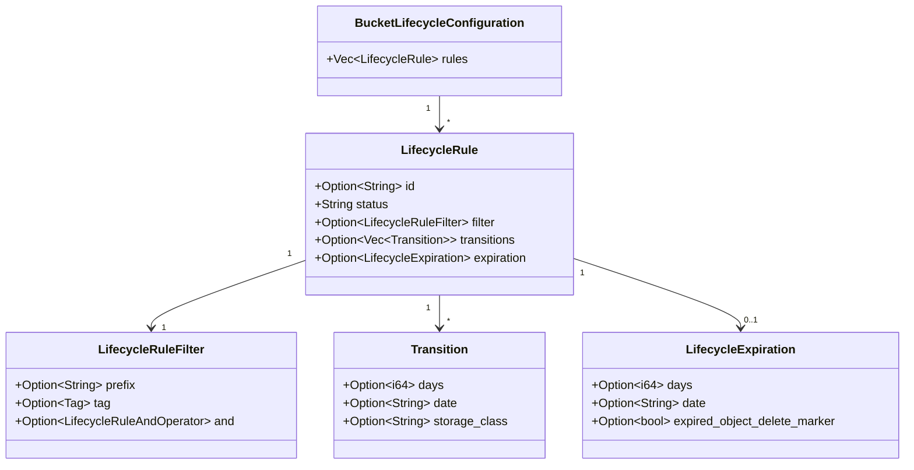

---

## Async Execution Model (2018 Era)

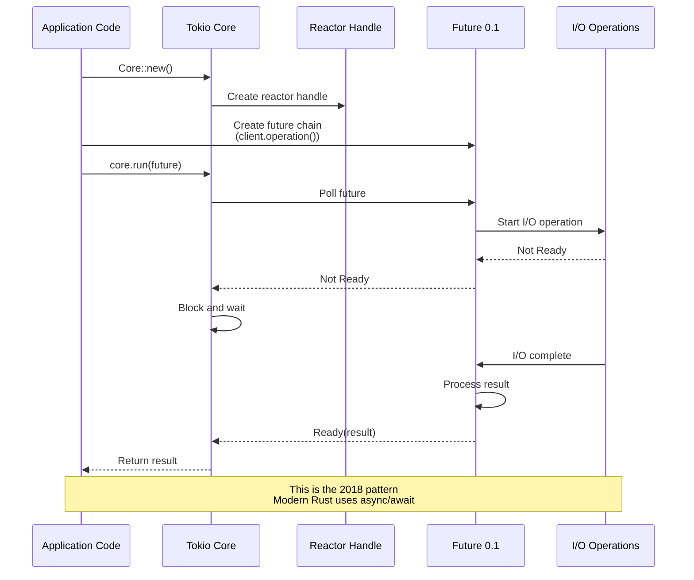

---

## Error Handling Flow

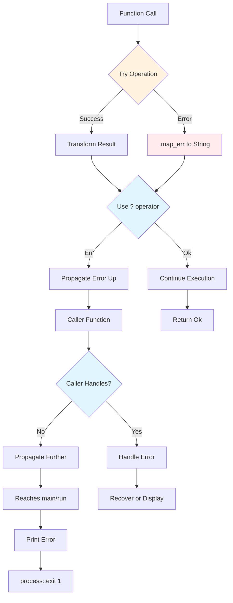

---

## S3 Storage Classes Flow

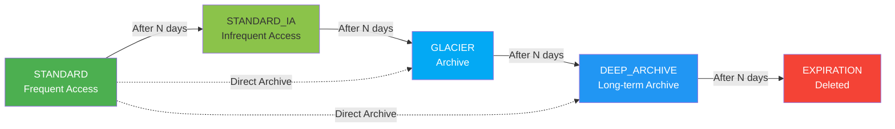

---

## Project File Structure

```
2018-july-rust-s3lifecycle-project/
│
├── Cargo.toml              # Dependencies (rusoto 0.42, tokio-core 0.1)
├── Cargo.lock              # Locked dependency versions
├── usage.txt               # Usage examples
│
└── src/
    ├── main.rs             # Main application code (538 lines)
    ├── explain.txt         # Line-by-line explanation
    └── architecture.md     # This file - architectural diagrams
```

---

## Key Architectural Decisions

### 1. **2018 Async Pattern**
- Uses `tokio-core::reactor::Core` instead of `#[tokio::main]`
- Explicit event loop creation and management
- `core.run(future)` blocks until completion
- No `.await` syntax (pre-Rust 1.39)

### 2. **Rust 2015 Edition**
- Requires `extern crate` declarations
- Compatible with 2018-era toolchains
- Maintains historical accuracy

### 3. **Error Handling Strategy**
- All functions return `Result<(), String>`
- `.map_err()` for error conversion
- `?` operator for error propagation
- User-friendly error messages

### 4. **CLI Design Pattern**
- Builder pattern with Clap 2.x
- Subcommand-based interface
- Fluent API for argument definition
- Pre-derive macro style

### 5. **S3 Archival Technique**
- Copy object to itself with new storage class
- Standard AWS pattern for storage class changes
- Pagination for large object lists
- Continuation tokens for next pages

### 6. **Rusoto 0.42 API**
- `BucketLifecycleConfiguration` (not `LifecycleConfiguration`)
- Request/Response pattern
- Async operations via futures 0.1
- AWS credential chain support

---

## Execution Flow Summary

1. **CLI Parsing**: Clap parses command-line arguments
2. **Event Loop Creation**: Tokio Core creates async runtime
3. **S3 Client Initialization**: Rusoto client with AWS credentials
4. **Command Dispatch**: Match on subcommand and route to handler
5. **Async Execution**: `core.run()` executes AWS operations
6. **Result Display**: Format and print results to console
7. **Error Handling**: Convert and display errors, exit with code

---

## Integration Points

### AWS S3 API
- **Authentication**: AWS credentials from environment, file, or IAM role
- **Region**: Configurable via AWS_REGION or default
- **Operations**: GET/PUT/DELETE lifecycle configurations, LIST/COPY objects
- **Error Handling**: AWS SDK errors converted to user-friendly strings

### Terminal/Shell
- **Input**: Command-line arguments parsed by Clap
- **Output**: Formatted text to stdout
- **Errors**: Error messages to stderr
- **Exit Codes**: 0 for success, 1 for error

---

## Concurrency Model

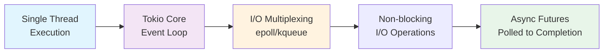

**Note**: This is a single-threaded async model. All operations run on one thread using an event loop, unlike modern Tokio which uses work-stealing thread pools.

---

## Version History Context

| Component | 2018 Version | Modern Equivalent |
|-----------|--------------|-------------------|
| Rust Edition | 2015 | 2021 |
| Tokio | tokio-core 0.1 | tokio 1.x with #[tokio::main] |
| Futures | futures 0.1 | futures 0.3 with async/await |
| Clap | 2.32 (builder) | 4.x with derive macros |
| Rusoto | 0.42 | AWS SDK for Rust |
| Async Syntax | .and_then(), .map_err() | async/await |

---

## Conclusion

This architecture represents a faithful reproduction of 2018-era Rust async programming patterns. The design emphasizes:
- Explicit event loop management
- Manual future composition
- Builder patterns for CLIs
- Pre-async/await ergonomics

While more verbose than modern Rust, this pattern was the foundation that led to today's async/await syntax and demonstrates the evolution of Rust's async ecosystem.

